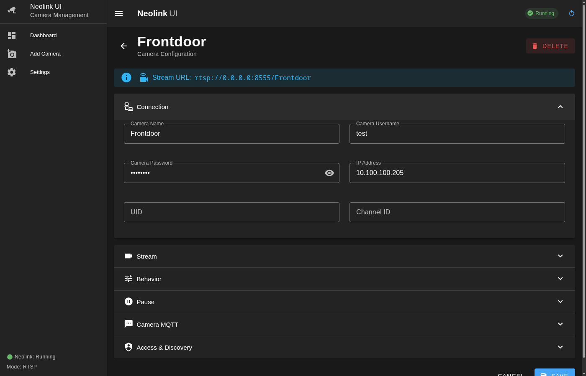

# neolink-ui

A web interface for [neolink](https://github.com/QuantumEntangledAndy/neolink) — the bridge that converts Reolink cameras' proprietary Baichuan protocol into standard RTSP/MQTT streams.

Instead of hand-editing TOML files and managing the neolink process from the terminal, this gives you a browser-based UI to do it all. Built primarily for Docker and Unraid, but works anywhere Node.js runs.


## Screenshots




## What it does

- **Camera management** — add, edit, delete cameras through a form instead of editing TOML by hand
- **RTSP stream config** — configure stream type, buffer duration, splash screens per camera
- **MQTT support** — set up broker connection, per-camera MQTT topics (motion, light, battery, etc.)
- **User management** — manage RTSP authentication users
- **Process control** — start, stop, restart neolink from the UI, view live logs
- **Home Assistant discovery** — configure HA MQTT discovery topics and features per camera
- **Optional auth** — protect the UI with a password, or leave it open on a trusted network

## Quick start (Docker)

The easiest way to run it:

```bash
docker run -d \
  --name neolink-ui \
  --network host \
  -v /path/to/your/neolink.toml:/etc/neolink.toml \
  -e NEOLINK_UI_PASSWORD=changeme \
  ll0rd/neolink-ui
```

Host networking is recommended so neolink can discover cameras on your LAN and expose the RTSP port directly.

The web UI will be available at `http://your-ip:9080`.

Once you've added a camera, the RTSP streams are available at:

```
rtsp://your-ip:8554/CameraName             # main stream (full resolution)
rtsp://your-ip:8554/CameraName/sub         # sub stream (lower resolution)
```

### Docker Compose

```yaml
services:
  neolink-ui:
    image: ll0rd/neolink-ui:latest
    container_name: neolink-ui
    network_mode: host
    environment:
      - NEOLINK_UI_PASSWORD=changeme
      - NEOLINK_CONFIG_PATH=/etc/neolink.toml
      - NEOLINK_MODE=rtsp
    volumes:
      - ./config/neolink.toml:/etc/neolink.toml
    restart: unless-stopped
```

### Unraid

An Unraid Community Applications template is included (`neolink-ui.xml`). Import it and configure the ports, config path, and optional password through the Unraid UI.

## Environment variables

| Variable | Default | Description |
|---|---|---|
| `NEOLINK_UI_PASSWORD` | *(empty)* | Password for the web UI. Leave empty to disable authentication. |
| `NEOLINK_CONFIG_PATH` | `/etc/neolink.toml` | Path to the neolink TOML config file |
| `NEOLINK_BINARY_PATH` | `/usr/local/bin/neolink` | Path to the neolink binary |
| `NEOLINK_MODE` | `rtsp` | Neolink operating mode (`rtsp` or `mqtt`) |
| `PORT` | `9080` | Web UI port |

## Development

Requirements: Node.js 20+

```bash
git clone https://github.com/your-user/neolink-ui.git
cd neolink-ui
npm install
```

You'll need a neolink binary and a config file. Point to them with env vars:

```bash
NEOLINK_CONFIG_PATH=./neolink.toml \
NEOLINK_BINARY_PATH=/usr/local/bin/neolink \
npm run dev
```

The app starts at `http://localhost:9080`. Without the neolink binary, everything works except actually running neolink — you can still use the config editor.

## Building the Docker image

```bash
docker build -t neolink-ui .
```

The Dockerfile is a multi-stage build that:
1. Pulls the neolink binary from `quantumentangledandy/neolink:latest`
2. Builds the Nuxt app
3. Creates a slim Debian runtime with Node.js 20 and the GStreamer dependencies neolink needs

## Project structure

```
neolink-ui/
├── app/                    # Frontend (Nuxt 4 app directory)
│   ├── pages/              # Routes: dashboard, camera edit, settings, login
│   ├── components/         # Vue components (camera forms, settings, layout)
│   ├── stores/             # Pinia stores (auth, config, process)
│   ├── composables/        # Shared logic (auth, notifications)
│   └── middleware/          # Client-side auth guard
├── server/                 # Backend (Nitro server routes)
│   ├── api/                # REST API: /api/config/*, /api/process/*, /api/auth/*
│   ├── utils/              # Config manager, process manager, session handling
│   └── plugins/            # Auto-start neolink on boot
└── shared/                 # Types shared between frontend and backend
    └── types/
```

## How it works

The app runs as a single Node.js process (Nuxt/Nitro) that manages the neolink binary as a child process. Config changes are written directly to the TOML file. When you change settings that require a restart, you can restart neolink from the UI.

The TOML config is the source of truth — the UI reads and writes it directly. If you edit the file manually, the UI will pick up the changes on next load (there's a short cache).

## Notes

- The TOML round-trip will strip comments from your config file. If you have a heavily commented config you want to preserve, back it up before using the UI.
- Push notification warnings in the logs are normal — neolink tries to connect to Reolink's cloud service, which usually isn't needed.
- If port 8554 is already in use on your host, change the RTSP bind port in Settings > General.

## License

MIT
